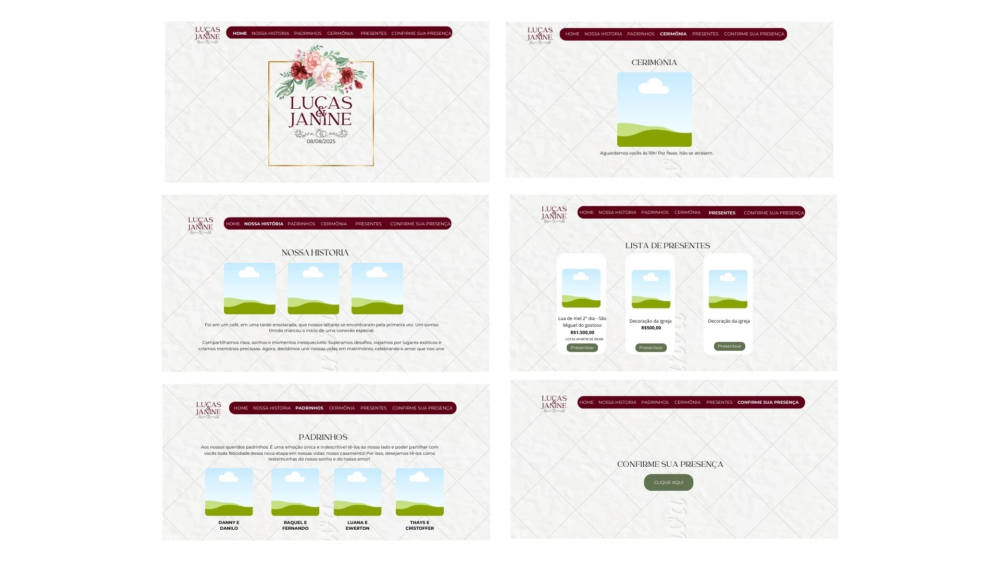

# Wedding Website

Bem-vindo ao repositório do site do nosso casamento!  
Este projeto foi desenvolvido com muito carinho para compartilhar informações importantes sobre a cerimônia, facilitar a confirmação de presença e ajudar na organização do evento.

## 👰🤵 Sobre o Projeto

O objetivo do site é oferecer uma experiência acolhedora e prática para nossos convidados. Através dele é possível:

- 📍 Visualizar o local e horário da cerimônia
- 🧾 Conhecer nossa história e os padrinhos
- 🎁 Escolher cotas de presentes
- ✅ Confirmar presença de forma simples via formulário
- 📆 Acompanhar a contagem regressiva para o grande dia

## 🛠️ Tecnologias Utilizadas

O site foi desenvolvido utilizando:

- **HTML5** – Estrutura e semântica das páginas
- **CSS3** – Estilização e responsividade
- **JavaScript** – Interatividade e manipulação do DOM

## 🚀 Funcionalidades

- ✅ Navegação dinâmica entre seções
- ✅ Menu recolhido com sidebar em dispositivos móveis
- ✅ Contagem regressiva em tempo real até o evento
- ✅ Responsividade para celular e desktop
- ✅ Formulário externo de RSVP via Google Forms
- ✅ Integração com Google Maps
- ✅ Confirmação de presente via botão com redirecionamento para o WhatsApp

## 📂 Estrutura do Repositório

```plaintext
📁 WEDDING
 ├── 📂 imagens/              # Imagens usadas no site
 │   ├── fotosCasal/
 │   ├── albumFotos/
 │   ├── fotospadrinhos/
 │   └── icone.png
 ├── 📂 Prototipo/            # Imagens do layout do protótipo
 ├── 📜 home.html             # Página principal
 ├── 📜 style.css             # Estilização global
 ├── 📜 script.js             # Scripts para interatividade
 └── 📜 README.md             # Documentação
```

## 🎨 Capturas de Tela

Demonstração, aparência e usabilidade do site.





## 🔧 Como Executar o Projeto

1. Clone este repositório:
   ```bash
   git clone https://github.com/janinealves04/WEDDING.git
   ```
2. Acesse a pasta do projeto:
   ```bash
   cd WEDDING
   ```
3. Abra o arquivo `home.html` no navegador.

## 📌 Melhorias Futuras

- Backend para registrar e mostrar presentes já escolhidos
- Adicionar aria-labels e alt mais descritivos


## 🧠 Aprendizados

Durante o desenvolvimento, foram praticados diversos conceitos importantes de Web:

- Manipulação do DOM com JavaScript puro
- Eventos e funções para navegação por seções
- Implementação de menus responsivos
- Responsividade com Media Queries
- Boas práticas de organização de arquivos
- Integração com serviços externos (Google Forms, Maps, WhatsApp)


## 📲 Acessibilidade e Performance
O site já considera boas práticas como:

- Uso de cores com bom contraste
- Fonte legível e espaçamento adequado
- Layout adaptável a diferentes tamanhos de tela
- Tamanhos de botão adequados para toque

## 📞 Contato

Caso tenha dúvidas ou sugestões, sinta-se à vontade para entrar em contato!

**Contato:** [janinealves.developer@gmail.com](mailto\:janinealves.developer@gmail.com)
**Instagram:** @dev.janine
---

**Desenvolvido com ❤️ por Janine Alves**


